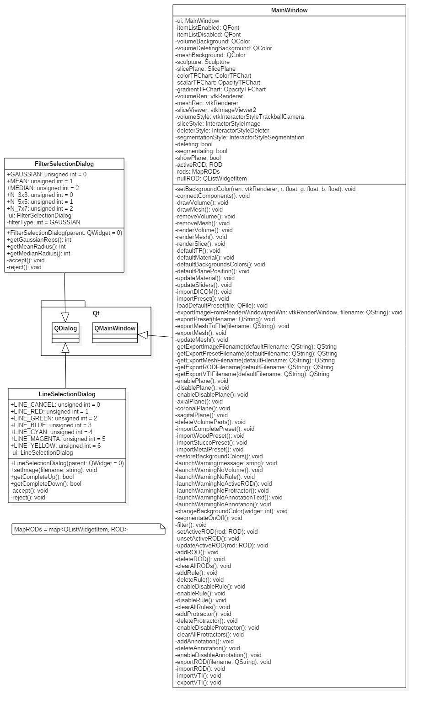

# 3D Curator

> Francisco Javier Bolívar Lupiáñez

## UML Documentation

### Class Diagrams

#### Chart

#### Core

#### Documentation

#### GUI

#### Interactor

#### Segmentation

#### Util

#### Widget

